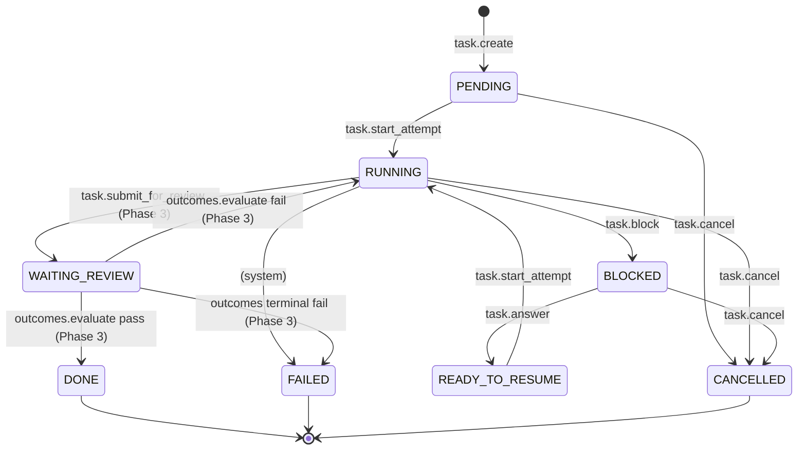

# Cairn Task Capsule — State Machine

这是 Task Capsule 的规范状态图，首次引入于 W5 Phase 1，BLOCKED 闭环在 Phase 2 激活。图中展示的是任务从创建到终止的全部可能状态转换。**Phase 1+2 已激活 8 条 transition**（详见下方 legend）；Phase 3 将激活 WAITING_REVIEW 相关的 4 条 outcomes 验收 transition。本图作为产品契约的一部分，状态机源代码见 `packages/daemon/src/storage/tasks-state.ts` `VALID_TRANSITIONS`。

## 状态转换说明

### Phase 1+2 已激活的 transitions（8 条）

| Transition | 触发动词 | 引入 Phase |
|---|---|---|
| **PENDING → RUNNING** | `cairn.task.start_attempt` | Phase 1 |
| **PENDING → CANCELLED** | `cairn.task.cancel` | Phase 1 |
| **RUNNING → CANCELLED** | `cairn.task.cancel` | Phase 1 |
| **RUNNING → BLOCKED** | `cairn.task.block` | **Phase 2** |
| **BLOCKED → READY_TO_RESUME** | `cairn.task.answer`（仅当所有 blocker ANSWERED；LD-7 多 blocker 计数） | **Phase 2** |
| **BLOCKED → CANCELLED** | `cairn.task.cancel`（自动支持，cancel 工具 Phase 1 已写） | Phase 2 自动 |
| **READY_TO_RESUME → RUNNING** | `cairn.task.start_attempt`（同一工具，从不同源状态进入） | **Phase 2** |
| **RUNNING → FAILED** | `(system)` — 系统错误导致不可恢复失败（Phase 1+2 暂不主动写） | 备用 |

### Phase 3 占位 transitions（仍未激活）

以下 transition 在 `VALID_TRANSITIONS` 中已写好，guard 已就绪，但**还没有 MCP 工具触发**——Phase 3 加入后激活：

- **RUNNING → WAITING_REVIEW**：标注 `(Phase 3)`。Agent 通过 `cairn.task.submit_for_review` 声称完成，等待 outcomes 验收。
- **WAITING_REVIEW → DONE**：标注 `(Phase 3)`。`cairn.outcomes.evaluate` 验收通过。
- **WAITING_REVIEW → RUNNING**：标注 `(Phase 3)`。验收失败回到运行状态重试。
- **WAITING_REVIEW → FAILED**：标注 `(Phase 3)`。验收终判失败。

## 源码引用

- **TS 状态常量与转换表**：`packages/daemon/src/storage/tasks-state.ts`（`VALID_TRANSITIONS` 常量）
- **完整设计文档**：`docs/superpowers/plans/2026-05-07-w5-task-capsule.md` §3 State Machine
