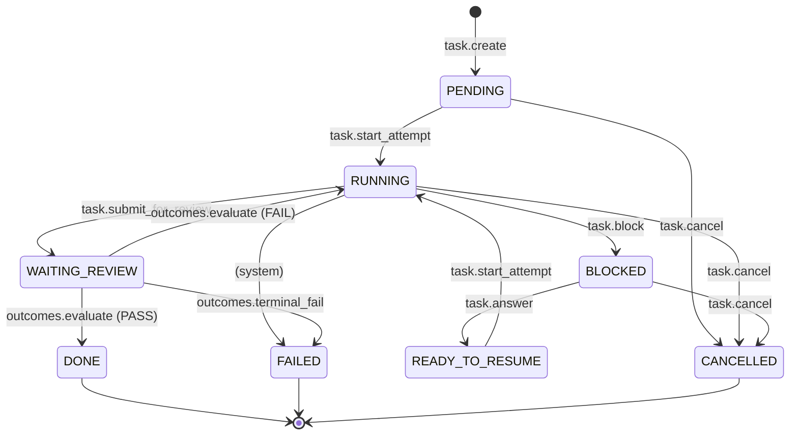

# Cairn Task Capsule — State Machine

这是 Task Capsule 的规范状态图，首次引入于 W5 Phase 1，BLOCKED 闭环在 Phase 2 激活，outcomes 验收闭环在 Phase 3 激活。**全部 12 条 transition 现已 active**。本图作为产品契约的一部分，状态机源代码见 `packages/daemon/src/storage/tasks-state.ts` `VALID_TRANSITIONS`。

## 状态转换说明

### Phase 1+2 已激活的 transitions（8 条）

| Transition | 触发动词 | 引入 Phase |
|---|---|---|
| **PENDING → RUNNING** | `cairn.task.start_attempt` | Phase 1 |
| **PENDING → CANCELLED** | `cairn.task.cancel` | Phase 1 |
| **RUNNING → CANCELLED** | `cairn.task.cancel` | Phase 1 |
| **RUNNING → BLOCKED** | `cairn.task.block` | **Phase 2** |
| **BLOCKED → READY_TO_RESUME** | `cairn.task.answer`（仅当所有 blocker ANSWERED；LD-7 多 blocker 计数） | **Phase 2** |
| **BLOCKED → CANCELLED** | `cairn.task.cancel`（自动支持，cancel 工具 Phase 1 已写） | Phase 2 自动 |
| **READY_TO_RESUME → RUNNING** | `cairn.task.start_attempt`（同一工具，从不同源状态进入） | **Phase 2** |
| **RUNNING → FAILED** | `(system)` — 系统错误导致不可恢复失败（Phase 1+2 暂不主动写） | 备用 |

### Phase 3 已激活的 transitions（4 条）

| Transition | 触发动词 | 引入 Phase |
|---|---|---|
| **RUNNING → WAITING_REVIEW** | `cairn.task.submit_for_review`（LD-12 upsert：首次 INSERT outcome + 提交 criteria；retry 复用 outcome_id 重置 PENDING、criteria 冻结） | **Phase 3** |
| **WAITING_REVIEW → DONE** | `cairn.outcomes.evaluate` 验收 PASS（LD-15 全 AND；LD-17 同步阻塞） | **Phase 3** |
| **WAITING_REVIEW → RUNNING** | `cairn.outcomes.evaluate` 验收 FAIL — agent 修后再 submit_for_review 走 upsert 重置（P1.1 闭环） | **Phase 3** |
| **WAITING_REVIEW → FAILED** | `cairn.outcomes.terminal_fail`（用户主动放弃；只允许从 PENDING outcome 终判，FAIL 状态下 task 已回 RUNNING，应走 cancel） | **Phase 3** |

### 故意不存在的 transition：WAITING_REVIEW → CANCELLED（P1.2 锁）

`VALID_TRANSITIONS['WAITING_REVIEW']` 是 `{DONE, RUNNING, FAILED}`，**不含** CANCELLED。LD-17 让 evaluate 同步阻塞，WAITING_REVIEW 实际只是 sub-second 中转态；任何"我想中途取消"的需求路径是：等 evaluate 返回（最长 60s/原语），task 落到 RUNNING（FAIL 或 TIMEOUT）或 DONE，然后从 RUNNING 调 `cancel`；evaluate 之前的 PENDING outcome 上则可以走 `terminal_fail`。

## 源码引用

- **TS 状态常量与转换表**：`packages/daemon/src/storage/tasks-state.ts`（`VALID_TRANSITIONS` 常量）
- **完整设计文档**：`docs/superpowers/plans/2026-05-07-w5-task-capsule.md` §3 State Machine
