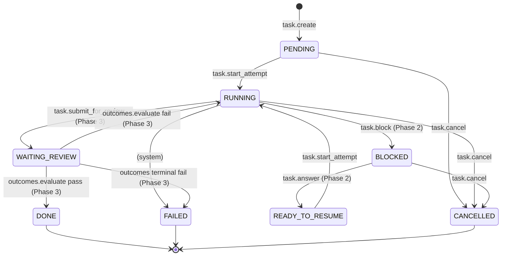

# Cairn Task Capsule — State Machine

这是 Task Capsule 的规范状态图，首次引入于 W5 Phase 1。图中展示的是任务从创建到终止的全部可能状态转换。Phase 1 仅激活其中 3 条 transition（`PENDING→RUNNING`、`PENDING→CANCELLED`、`RUNNING→CANCELLED`）；Phase 2 和 Phase 3 将逐步激活其他状态和转换。本图作为产品契约的一部分，所有状态机的实现细节见 `docs/superpowers/plans/2026-05-07-w5-task-capsule.md` §3。

## 状态转换说明

### Phase 1 已激活的 transitions

以下三条转换在 Phase 1 中实现并可用：

- **PENDING → RUNNING**：通过 `cairn.task.start_attempt` 工具触发。agent 认领任务并开始推进。
- **PENDING → CANCELLED**：通过 `cairn.task.cancel` 工具触发。任务在启动前被取消。
- **RUNNING → CANCELLED**：通过 `cairn.task.cancel` 工具触发。任务在执行中被取消。

### Phase 2/3 占位 transitions

以下转换在本周不激活，但已在数据 schema 中保留位置，后续 phase 可直接启用：

- **RUNNING → BLOCKED**：标注为 `(Phase 2)`。Agent 遇到阻碍（需要用户或其他 agent 答复），暂停任务。
- **BLOCKED → READY_TO_RESUME**：标注为 `(Phase 2)`。问题得到答复，任务准备继续。
- **RUNNING → WAITING_REVIEW**：标注为 `(Phase 3)`。Agent 声称工作完成，等待验收。
- **RUNNING → FAILED**：标注为 `(system)`。系统错误导致不可恢复失败（Phase 1 暂不主动触发）。
- **BLOCKED → CANCELLED**：允许从阻碍状态取消任务。
- **WAITING_REVIEW → DONE**：标注为 `(Phase 3)`。验收通过，任务完成。
- **WAITING_REVIEW → RUNNING**：标注为 `(Phase 3)`。验收失败，回到运行状态重试。
- **WAITING_REVIEW → FAILED**：标注为 `(Phase 3)`。验收终判失败。

## 源码引用

- **TS 状态常量与转换表**：`packages/daemon/src/storage/tasks-state.ts`（`VALID_TRANSITIONS` 常量）
- **完整设计文档**：`docs/superpowers/plans/2026-05-07-w5-task-capsule.md` §3 State Machine
